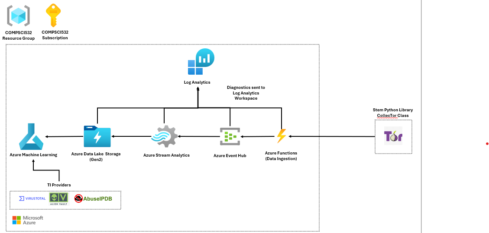

# COMPSCI 532: Tor Exit Nodes Analysis Project

This project demonstrates an end-to-end pipeline for analyzing Tor exit node data using Microsoft Azure. Tor network descriptors are ingested with Azure Functions, streamed through Event Hub, processed in Stream Analytics, and stored as parquet files in ADLS Gen2. The data is then enriched with external threat intelligence in Azure Machine Learning and used in large-scale AutoML experiments to generate predictive models and actionable insights.

---

### Azure Function App

Five timer-trigger functions and one event grid function run automatically at fixed intervals, fetch Tor Network data, and push events to Azure Event Hub for downstream processing in Azure Stream Analytics and storage in Azure Data Lake Storage Gen2.

| Function | Trigger | Source | Purpose |
|-----------|----------|---------|----------|
| `Get_Exit_Lists` | Timer: Every 24 hours | [Stem Docs](https://stem.torproject.org/api.html) | Requests TorDNSEL exit lists: mappings of which IP addresses were observed exiting the Tor network at specific times, useful for services that want to detect Tor-origin traffic. Approximately 20,000-30,000 events are then pushed to Azure Event Hub for capturing.|
| `Get_Consensus` | Timer: Every 24 hours | [Stem Docs](https://stem.torproject.org/api.html) | Requests router status entries (consensus documents): the authoritative network status generated hourly by directory authorities, listing all relays, their flags (Guard, Exit, Stable, etc.), and weights. Approximately 20,000-30,000 events are then pushed to Azure Event Hub for capturing.| 
| `Get_MicroDescriptors` | Timer: Every 24 hours | [Stem Docs](https://stem.torproject.org/api.html) | Requests microdescriptors: compact relay descriptors used by clients to build circuits. They contain essential relay info but omit bulkier details to reduce client download size. Approximately 20,000-30,000 events are then pushed to Azure Event Hub for capturing.|
| `Get_ExtraInfo_Descriptors` | Timer: Every 24 hours | [Stem Docs](https://stem.torproject.org/api.html) | Requests extra-info descriptors: supplementary relay statistics such as bandwidth usage, uptime, and exit policy details. Approximately 20,000-30,000 events are then pushed to Azure Event Hub for capturing.|
| `Get_Server_Descriptors` | Timer: Every 24 hours | [Stem Docs](https://stem.torproject.org/api.html) | Requests server descriptors: information about Tor relays, including their public keys, IP addresses, ports, and capabilities (e.g., whether they’re an exit node, guard, etc.). Approximately 20,000-30,000 events are then pushed to Azure Event Hub for capturing.|
| `Get_Exit_Lists_Curated` | Event Grid: Depends on Get_Exit_Lists | [Stem Docs](https://stem.torproject.org/api.html) | Captures TorDNSEL exit lists in Azure Event Hub processed in multiple partitions and merges them into one single parquet file in Azure Data Lake Storage Gen2. |

### Azure Event Hub

| Consumer Group | Partitions | Purpose |
|-----------|----------|---------|
| `get_exit_lists_consumer_group` | 10 | Consumes TorDNSEL exit list events (IP addresses observed exiting the Tor network). Used to detect Tor-origin traffic and analyze exit node activity. |
| `get_consensus_consumer_group` | 10 | 	Consumes consensus documents (router status entries). Provides authoritative network state: relay flags, weights, and overall topology for monitoring network health. |
| `get_extrainfo_descriptors_consumer_group` | 10 | Consumes extra-info descriptors. Captures relay statistics such as bandwidth usage, uptime, and exit policy details for performance and reliability analysis. |
| `get_microdescriptors_consumer_group` | 10 | Consumes microdescriptors. Provides compact relay descriptors used by clients to build circuits, enabling lightweight relay metadata analysis. |
| `get_server_descriptors_consumer_group` | 10 | Consumes server descriptors. Includes relay identity information (public keys, IPs, ports, capabilities) for mapping and classifying relays across the Tor network. |

### Azure Stream Analytics

| Job | Source | Purpose|
|-----------|----------|---------|
| `Get_Exit_Lists` | `get_exit_lists_consumer_group` | Filters TorDNSEL exit list events (IP addresses observed exiting the Tor network). Flattens JSON into rows of IP, timestamp, and relay ID. Stores parquet files in the Exit Lists container in ADLS Gen2, itemized by date/time for traffic attribution analysis. |
| `Get_Consensus` | `get_consensus_consumer_group` | 	Filters consensus documents (router status entries). Flattens relay flags, weights, and metadata into tabular form. Stores parquet files in the Consensus container in ADLS Gen2, partitioned by date/time to provide authoritative snapshots of the Tor network state. |
| `Get_ExtraInfo_Descriptors` | `get_extrainfo_descriptors_consumer_group` | Filters extra-info descriptors (relay statistics like bandwidth usage, uptime, exit policies). Flattens nested JSON into structured metrics. Stores parquet files in the ExtraInfo container in ADLS Gen2, itemized by date/time for performance monitoring and relay reliability analytics. |
| `Get_Microdescriptors` | `get_microdescriptors_consumer_group` | Filters microdescriptors (compact relay descriptors used by clients). Flattens relay identity and essential metadata. Stores parquet files in the Microdescriptors container in ADLS Gen2, partitioned by date/time for lightweight relay metadata analysis. |
| `Get_Server_Descriptors` | `get_server_descriptors_consumer_group` | Filters server descriptors (relay identity info: public keys, IPs, ports, capabilities). Flattens into structured rows. Stores parquet files in the Server Descriptors container in ADLS Gen2, itemized by date/time for mapping relay identities and classifying roles (Exit, Guard, etc.). |

### Azure Data Lake Storage Gen2

| Container | File Type | Purpose | 
|-----------|----------|---------|
| `Get_Exit_Lists` | Parquet | Stores TorDNSEL exit list events (IP addresses observed exiting the Tor network). Itemized by date/time for traffic attribution and exit node activity analysis. |
| `Get_Consensus` | Parquet | Stores consensus documents (router status entries). Provides authoritative snapshots of the Tor network state, partitioned by date/time for topology and reliability studies. |
| `Get_ExtraInfo_Descriptors` | Parquet | Stores extra-info descriptors (relay statistics like bandwidth usage, uptime, exit policies). Itemized by date/time for performance monitoring and relay reliability analytics. |
| `Get_Microdescriptors` | Parquet | Stores microdescriptors (compact relay descriptors used by clients). Partitioned by date/time for lightweight relay metadata analysis and client circuit-building research. |
| `Get_Server_Descriptors` | Parquet | Stores server descriptors (relay identity info: public keys, IPs, ports, capabilities). Itemized by date/time for mapping relay identities and classifying roles (Exit, Guard, etc.). |
| `Get_Exit_Lists_Curated` | Parquet | simliarly to Get_Exit_Lists, it stores TorDNSEL exit list events (IP addresses observed exiting the Tor network). Itemized by date/time for traffic attribution and exit node activity analysis. |

---

### Azure Machine Learning

In Azure Machine Learning, we began by creating data stores that connected directly to each container in Azure Data Lake Storage Gen2, such as `Get_Exit_Lists`, `Get_Consensus`, `Get_ExtraInfo_Descriptors`, `Get_Microdescriptors`, and `Get_Server_Descriptors`. This allowed us to securely access parquet files stored in ADLS Gen2 without needing to reconfigure authentication each time.  

From the `Get_Exit_Lists` data store, we selected one parquet file containing TorDNSEL exit list events and registered it as a data asset in Azure Machine Learning. We then loaded this data asset into a Jupyter notebook, where we enriched the dataset with external threat intelligence sources including IPWhoIs, VirusTotal, AlienVault OTX, and AbuseIPDB. This enrichment added valuable context such as ownership, geolocation, malware checks, and abuse reports to the raw exit node data.  

After enrichment, we wrote the dataset back into the `Get_Exit_Lists` data store as a new parquet file and registered it as a separate data asset. With this enriched dataset, we launched over 130 AutoML experiments in Azure Machine Learning. AutoML automatically tested multiple algorithms and hyperparameter combinations, ranking models by performance metrics and identifying the best candidates for deployment.  

This workflow demonstrates the full lifecycle: raw Tor data ingested into ADLS Gen2, transformed into AML data assets, enriched with threat intelligence, and then leveraged in large-scale AutoML experimentation to generate actionable machine learning models.  

---

[Watch the Zoom recording](https://zoom.us/rec/share/your_recording_link)

[Download the Project Slides](https://view.officeapps.live.com/op/view.aspx?src=https%3A%2F%2Fraw.githubusercontent.com%2Fian0671%2FCOMPSCI-532-Tor-Network-Node-Analysis%2Frefs%2Fheads%2Fmain%2Fpresentation%2FCOMPSCI532_Identifying%2520Malicious%2520Tor%2520Relays%252C%2520Bridges%2520%2526%2520Exit%2520Nodes.pptx&wdOrigin=BROWSELINK)

### Sources
- [Azure Functions Overview](https://learn.microsoft.com/en-us/azure/azure-functions/functions-overview)
- [Azure Event Hubs Overview](https://learn.microsoft.com/en-us/azure/event-hubs/event-hubs-about)
- [Azure Stream Analytics Overview](https://learn.microsoft.com/en-us/azure/stream-analytics/stream-analytics-introduction)
- [Azure Data Lake Storage Gen2 Overview](https://learn.microsoft.com/en-us/azure/storage/blobs/data-lake-storage-introduction)
- [Azure Machine Learning Overview](https://learn.microsoft.com/en-us/azure/machine-learning/overview-what-is-azure-machine-learning?view=azureml-api-2)
- [Stem Docs](https://stem.torproject.org/api.html)
- [VirusTotal API](https://docs.virustotal.com/reference/overview)
- [AlienVault OTX API](https://otx.alienvault.com/api)
- [AbuseIPDB API](https://docs.abuseipdb.com/#introduction)
